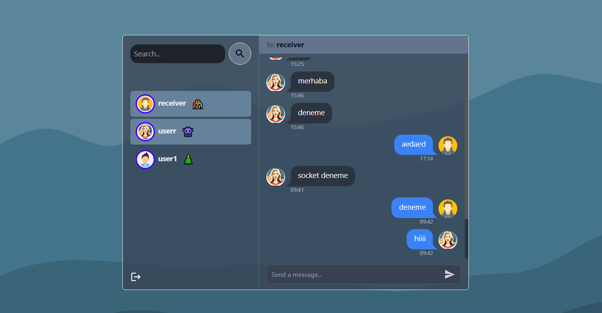
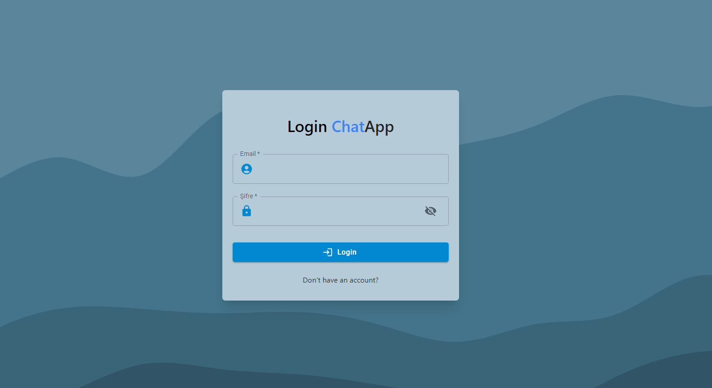

# Conference-App

This project is a chat project made using reactjs nor vode js.

## Technologies Used:
- ReactJs
- Tailwind CSS
- DaisyUI
- Socket.io
- React-Hook-Form
- React-Router-Dom
- React-Redux
- Redux-Persist
- Express
 

## Screenshots:
Below are screenshots of different screens within the project:

    
    

